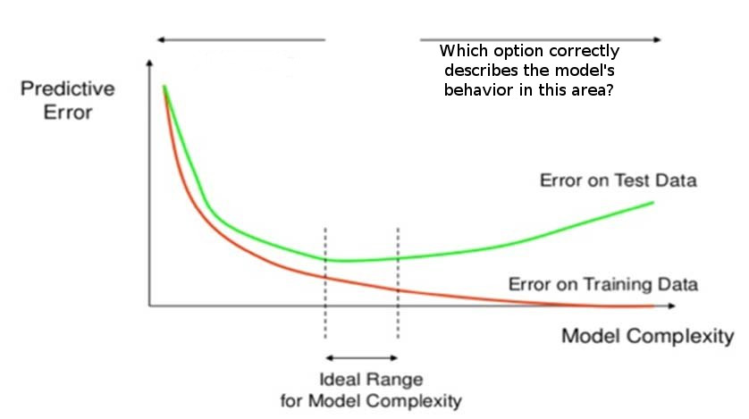

# Linear Classifiers in Python

Course: [Linear Classifiers in Python](https://www.datacamp.com/courses/linear-classifiers-in-python)

Prerequisites to course:
* Python, at the level of Intermediate Python for Data Science
* scikit-learn, at the level of Supervised Learning with scikit-learn
* supervised learning, at the level of Supervised Learning with scikit-learn

## Chapter 1: Applying logistic regression and SVM
In this chapter you will learn the basics of applying logistic regression and support vector machines (SVMs). You'll use the syntax from a popular machine learning library in Python called scikit-learn.

### Lesson 1: scikit-learn refresher
---
This lesson reviews the syntax in scikit-learn to achieve various supervised machine learning steps, ranging from loading data to model evaluation. It also emphasizes the approach required to avoid over-fitting.

#### Learning objectives
* The learner will be able to perform steps of supervised machine learning with KNN classifier, along with tunning it's hyper-parameter.
* The learner will be able to identify, why training error alone is a poor metric for the models ability to classify unseen data.
* The learner will be able to compare models by their individual testing accuracies.


### Lesson 2: Applying logistic regression and SVM
---
Firstly, this lesson will guide you in applying logistic regression and SVC classifiers on scikit-learn's built in datasets. Secondly, it cautions us on the over-fitting risk we take when using a complex classifier.

#### Learning objectives
* The learner will be able to apply LogisticRegression and SVC with default hyper-parameters
* The learner will be able to identify when a model is under-fitting vs over-fitting.

### Lesson 3: Linear classifiers
---
This lesson discuses what it means when a classifier is linear. It also reviews few key vocabulary that will be used in following chapters.

#### Learning objectives
* The learner will be able to differentiate between linear and non-linear decision boundaries.
* The learner will be able to visualize decision boundaries for 2 dimensional datasets.
* The learner will be familiarized on key vocabulary necessary for next chapter.


# Exercise Outline

## Lesson 1: scikit-learn refresher

### 1.1 Is the learner able to apply KNN classifier given the desired code output?
* BlanksChallenge
* Solution: KNeighborsClassifier() function

### 1.2 Is the user able to perform steps of supervised learning with KNN classifier?
* BlanksChallenge
* Solution: `.fit(X_train,y_train)` then `.score(X_train, y_train)` then `.score(X_test, y_test)`

### 1.3 Is the learner able to combine the `fit` and `predict` functions to obtain predicted class labels when applying KNN classifier?
* BlanksChallenge
* Solution: `.fit()` and then `.predict()`

### 1.4 Is the learner able to apply KNN classifier with a specified number of neighbors?
* BlanksChallenge
* Solution: `n_neighbors` argument

### 1.5 Does the learner understand the need to reserve some data for testing, in order to ensure that the model is not over-fitting?
* OutputChallenge
* Solution: `.fit(X_train, y_train)` instead of `.fit(X,y)`

### 1.6 Is the learner able to obtain testing accuracies for two KNN with different `n_neighbors`.
* OutputChallenge
* Solution: .score(X_test, y_test)

### 1.7 Is the learner able to calculate training accuracy for a KNN model?
* BlanksChallenge
* Solution: .score(X_test, y_test)

## Lesson 2: Applying logistic regression and SVM


### 2.1 Is the learner able to avoid using a complex classifier?

Given two models fitted on same dataset LogisticRegression and SVC respectively. Additionally SVC model has inferior testing accuracy, but has higher training accuracy.

* OutputChallenge
* Solution: `preferred_model = linear_svc`

### 2.2 Is the learner able to discriminate between a model under-fitting vs over-fitting?
* MultipleChoiceChallenge
* Solution: under-fitting models have low training accuracy and over-fitting models have a low testing accuracy

### 2.3 Is the learner able to combine the fit and predict_proba functions to obtain confidence score when applying LogisticRegression?
* BlanksChallenge
* Solution: `.fit()` and then `.predict_proba()`


### 2.4 Is the learner able to pick an ideal model given following options
|              | A |   B |  C|
|-|-|-|-|
training error | 20% | 30% | 10%|
testing error  | 15% | 10% |  20%|

* MultipleChoiceChallenge
* Solution: B

## Lesson 3: Linear classifiers

### 3.1 Is learner will able to differentiate between linear and non-linear decision boundaries?

Given decision boundary visualizations.

* MultipleChoiceChallenge
* Solution: identify liner boundary

### 3.2 Does the learner know definitions of key vocabulary?
* MultipleChoiceChallenge
* Solution:
    * classification: learning to predict categories
    * decision boundary: the surface separating different predicted classes
    * linear classifier: a classifier that learns linear decision boundaries
    * linearly separable: a data set can be perfectly explained by a linear classifier

# Exercise

## Ex #1 [MultipleChoiceChallenge]
### Question:

Refer to the attached image for question. Which option correctly describes the model's behavior?



### Possible answers:
* A. Overfitting
* B. Underfitting

### The correct answer is:
A

### This exercise tests:
Is the learner able to discriminate between a model under-fitting vs over-fitting?

[Image Reference](https://www.researchgate.net/figure/Overfitting-and-underfitting-effect-on-error_fig4_325999203)
Al-Behadili, Hayder & Ku-Mahamud, Ku & Sagban, Rafid. (2018). Rule pruning techniques in the ant-miner classification algorithm and its variants: A review. 10.1109/ISCAIE.2018.8405448.


## Ex #2 [OutputChallenge]
### Question:

In this exercise, we've applied LinearSVC and SVC on wine dataset.
The dataset is divided into three sections `train`,`test` and `unseen`.

Complete the code to achieve better score on `unseen` dataset.
```

import sklearn.datasets
from sklearn.model_selection import train_test_split
from sklearn.svm import LinearSVC
from sklearn.svm import SVC

wine = sklearn.datasets.load_wine()
X_train, X_unseen, y_train, y_unseen = train_test_split(wine.data, wine.target)
X_train, X_test, y_train, y_test = train_test_split(X_train, y_train)


linear_svc = LinearSVC()
svc = SVC() # default hyperparameters

linear_svc.fit(X_train, y_train)
print(linear_svc.score(X_train, y_train))
print(linear_svc.score(X_test, y_test))

svc.fit(X_train, y_train)
print(svc.score(X_train, y_train))
print(svc.score(X_test, y_test))


preferred_model = _ _ _ _

print(preferred_model.score(X_unseen, y_unseen))

```

### The correct answer is:
```
preferred_model = linear_svc
```

### This exercise tests:
Is the learner able to avoid using a complex classifier?

Given two models fitted on same dataset LogisticRegression and SVC respectively. Additionally SVC model has inferior testing accuracy, but has higher training accuracy.


## Ex #3 [BlanksChallenge]
### Question:
Fill in the correct function from scikit-learn to calculate Training accuracy
```
from sklearn import datasets
from sklearn.model_selection import train_test_split
from sklearn.neighbors import KNeighborsClassifier
digits = datasets.load_digits()
Xtrain, Xtest, ytrain, ytest = train_test_split(digits.data, digits.target)

knn = KNeighborsClassifier()
knn.fit(Xtrain,ytrain)

training_accuracy = knn._ _ _ _

print("Training accuracy = {0}".format(training_accuracy))
```

### The correct answer is:
`score(X_test, y_test)`

### This exercise tests:
Is the learner able to calculate training accuracy for a KNN model?